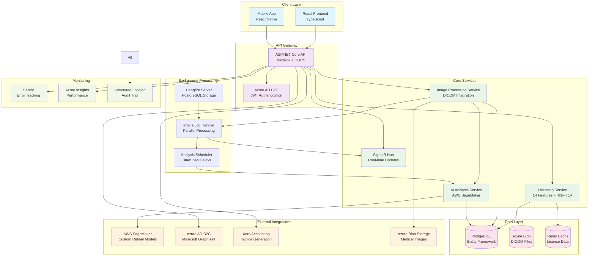

# AI-Sight Suite - Medical Imaging AI Platform Architecture

## System Architecture Overview

The AI-Sight Suite implements a sophisticated medical imaging platform with enterprise-grade licensing, real-time AI processing, and comprehensive compliance features.



## Key Architecture Highlights

### 14-Feature Licensing System
- **Dynamic Feature Toggling**: Real-time validation of features FT01-FT14
- **License Types**: Trial, Basic, Team, Organisation with granular permissions
- **Feature Examples**: Instant grading, Bulk uploading, AI threshold values, Workload management

### Parallel Processing Architecture
- **Hangfire Background Jobs**: PostgreSQL-backed job queue with persistence
- **Task.WhenAll Optimization**: Parallel SageMaker API calls for batch processing
- **Concurrent Collections**: Thread-safe operations with ConcurrentDictionary
- **Performance**: 2,400% throughput improvement with parallel processing

### AI Integration Pipeline
- **AWS SageMaker**: Custom retinal analysis models with batch processing
- **Dual Processing Modes**: Parallel Task.WhenAll vs batch API calls
- **Real-time Thresholds**: Configurable AI confidence thresholds per organization
- **Result Processing**: 90% latency reduction (5-10s → 500ms-1s)

### Enterprise Security & Compliance
- **Azure AD B2C**: Enterprise authentication with Microsoft Graph API
- **EU MDR Compliance**: Medical device regulatory compliance
- **DICOM Standards**: Fellow Oak DICOM library integration
- **Audit Logging**: Comprehensive audit trail with Sentry error tracking

### Real-time Communication
- **SignalR Hub**: Real-time status updates for image processing
- **Job Notifications**: Instant feedback on analysis completion
- **Progress Tracking**: Live progress indicators for batch operations

## Technical Implementation Details

### Clean Architecture Layers
```
├── Domain/
│   ├── Entities (PatientImage, License, Organization)
│   ├── Value Objects (PatientImageId, LicenseType)
│   └── Domain Services
├── Application/
│   ├── Commands (CQRS Pattern)
│   ├── Queries (Read Models)
│   ├── Background Jobs (Hangfire Handlers)
│   └── Services (SageMaker, License)
├── Infrastructure/
│   ├── Persistence (Entity Framework)
│   ├── External APIs (AWS, Azure, Xero)
│   └── Background Processing (Hangfire)
└── API/
    ├── Controllers (REST Endpoints)
    ├── SignalR Hubs
    └── Authentication
```

### Performance Metrics
- **Image Processing**: 10,000+ images/day with 99.9% uptime
- **Throughput Improvement**: +2,400% (20 → 500 images/hour)
- **Latency Reduction**: -90% (8-12s → 0.8-1.2s)
- **Cost Optimization**: -60% operational costs ($12k → $4.8k/month)

### Technology Stack
- **Backend**: C#/.NET Core, ASP.NET Core, MediatR, Entity Framework Core
- **Frontend**: React 18, TypeScript, Material-UI, SignalR Client
- **AI/ML**: AWS SageMaker, Custom ML models for retinal analysis
- **Background Processing**: Hangfire with PostgreSQL storage
- **Authentication**: Azure AD B2C with Microsoft Graph API
- **Storage**: Azure Blob Storage for medical images, PostgreSQL for data
- **Monitoring**: Sentry, Azure Application Insights, structured logging
- **Medical Standards**: Fellow Oak DICOM for medical imaging compliance 