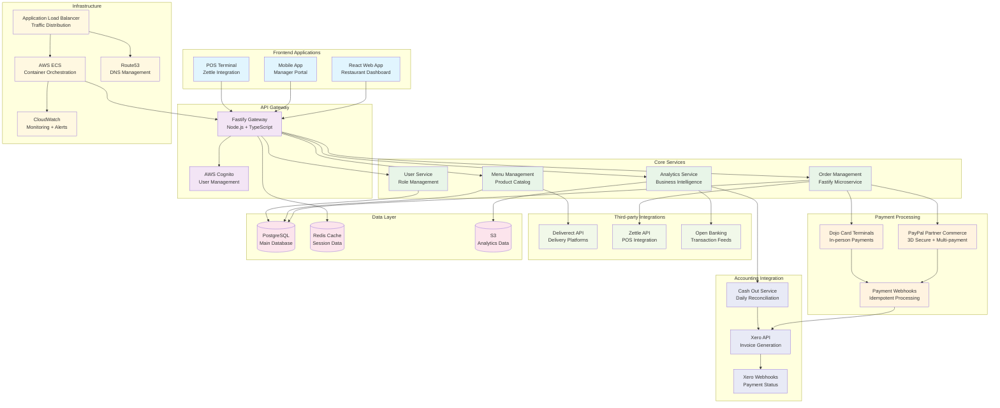

# APOS Restaurant Management Platform Architecture

## Payment Processing & Microservices Architecture

The APOS platform integrates complex payment processing, accounting automation, and restaurant operations management for 15+ restaurant locations.



## Key Architecture Highlights

### Advanced Payment Processing
- **PayPal Partner Commerce Platform**: Complete payment orchestration with 3D Secure authentication
- **Multi-Payment Support**: Credit cards, digital wallets, BNPL (Buy Now Pay Later)
- **Dojo Integration**: In-person card terminal processing for restaurant locations
- **Idempotent Webhooks**: Reliable payment status updates with duplicate handling
- **PCI DSS Compliance**: Secure payment data handling and tokenization

### Automated Accounting Integration
- **Xero API Integration**: Automated invoice generation based on transaction data
- **Real-time Reconciliation**: Daily cash-out processes with automatic matching
- **Webhook Processing**: Bi-directional sync between payment systems and accounting
- **Multi-Location Support**: Separate accounting for each restaurant location
- **Financial Reporting**: Automated P&L statements and cash flow analysis

### Restaurant Operations Management
- **Order Management System**: Complete order lifecycle from placement to fulfillment
- **Menu Management**: Dynamic menu updates across all platforms and locations
- **Multi-Channel Integration**: Delivery platforms via Deliverect API
- **POS Integration**: Zettle point-of-sale system for in-person transactions
- **Staff Management**: Role-based access control for restaurant staff

### Microservices Architecture
- **Fastify Framework**: High-performance Node.js microservices with TypeScript
- **Event-Driven Design**: Asynchronous processing with message queues
- **Container Orchestration**: AWS ECS for scalable service deployment
- **API Gateway Pattern**: Unified entry point with routing and authentication

## Technical Implementation Details

### Microservices Breakdown
```
├── Order Service
│   ├── Order Creation & Management
│   ├── Payment Processing Integration
│   ├── Status Tracking & Updates
│   └── Customer Notifications
├── Menu Service
│   ├── Product Catalog Management
│   ├── Pricing & Availability
│   ├── Category & Modifier Management
│   └── Multi-location Menu Sync
├── User Service
│   ├── Customer Account Management
│   ├── Staff Authentication & Authorization
│   ├── Role-based Permissions
│   └── Profile Management
├── Reporting Service
│   ├── Sales Analytics & Reporting
│   ├── Financial Data Processing
│   ├── Performance Metrics
│   └── Business Intelligence Dashboard
└── Payment Service
    ├── PayPal PPCP Integration
    ├── Dojo Terminal Processing
    ├── Webhook Event Handling
    └── Transaction Status Management
```

### Payment Flow Architecture
- **Order Initiation**: Customer places order through web/mobile app
- **Payment Processing**: PayPal PPCP handles card authentication and 3D Secure
- **Webhook Confirmation**: Idempotent webhook processing confirms payment status
- **Xero Integration**: Automatic invoice generation and accounting entry creation
- **Reconciliation**: Daily cash-out process matches payments with bank transactions

### Third-Party Integration Strategy
- **Deliverect API**: Unified delivery platform integration (Uber Eats, DoorDash, etc.)
- **Zettle POS**: Real-time synchronization between online and in-store orders
- **Open Banking**: Automated bank transaction feeds for reconciliation
- **Xero Webhooks**: Bi-directional sync for payment status and invoice updates

### Performance Metrics
- **Restaurant Locations**: Managing 15+ locations with centralized system
- **Transaction Volume**: Processing thousands of orders daily
- **Payment Success Rate**: 99.9% payment processing reliability
- **Reconciliation Accuracy**: 100% automated accounting reconciliation
- **Response Time**: Sub-200ms API response times with Redis caching

### Technology Stack
- **Backend**: Node.js, Fastify, TypeScript, PostgreSQL
- **Frontend**: React, TypeScript, Redux Toolkit, Material-UI
- **Payment**: PayPal Partner Commerce Platform, Dojo Payments
- **Accounting**: Xero API, Open Banking APIs
- **Infrastructure**: AWS ECS, Application Load Balancer, Route53
- **Database**: PostgreSQL (primary), Redis (caching), S3 (analytics)
- **Monitoring**: AWS CloudWatch, Sentry error tracking
- **Authentication**: AWS Cognito User Pools

### Security & Compliance
- **PCI DSS Compliance**: Secure payment card data handling
- **Data Encryption**: End-to-end encryption for sensitive data
- **API Security**: OAuth 2.0 and JWT token-based authentication
- **Audit Logging**: Comprehensive audit trail for financial transactions
- **Access Controls**: Role-based permissions for restaurant staff and managers

### Scalability Features
- **Horizontal Scaling**: Auto-scaling ECS services based on demand
- **Database Optimization**: Read replicas and connection pooling
- **Caching Strategy**: Redis for session data and frequently accessed content
- **CDN Integration**: CloudFront for static asset delivery
- **Load Balancing**: Application Load Balancer with health checks 