# CardMedic Platform - Healthcare Communication Architecture

## Cross-Platform Communication Architecture

The CardMedic platform provides seamless healthcare communication across multiple platforms with offline-first design and real-time translation capabilities serving 100,000+ patients.

```mermaid
graph TB
    subgraph "Client Applications"
        Flutter[Flutter Mobile App<br/>iOS + Android + Web]
        ReactNative[React Native<br/>Legacy Migration]
        AdminPortal[React Admin Portal<br/>Content Management]
    end

    subgraph "API Gateway Layer"
        APIGateway[AWS API Gateway<br/>REST + GraphQL]
        Cognito[AWS Cognito<br/>User Pool Management]
    end

    subgraph "Microservices"
        UserService[User Service<br/>Lambda + Node.js]
        TranslationService[Translation Service<br/>Lambda + Python]
        ContentService[Content Service<br/>Lambda + Node.js]
        AnalyticsService[Analytics Service<br/>Lambda + Node.js]
    end

    subgraph "Communication Services"
        TwilioVoice[Twilio Voice API<br/>Real-time Calls]
        Polly[Amazon Polly<br/>Text-to-Speech]
        AzureSpeech[Azure Speech<br/>TTS + STT]
        GoogleTTS[Google Cloud TTS<br/>Voice Synthesis]
        FCM[Firebase Cloud Messaging<br/>Push Notifications]
    end

    subgraph "Content Management"
        Contentful[Contentful CMS<br/>Headless Content]
        S3Content[S3 Bucket<br/>Media Storage]
        CloudFront[CloudFront CDN<br/>Global Distribution]
    end

    subgraph "Data Layer"
        DynamoDB[(DynamoDB<br/>User Data)]
        Sembast[(Local SQLite<br/>Offline Storage)]
        RDS[(RDS PostgreSQL<br/>Analytics)]
        S3Data[(S3<br/>Audio Files)]
    end

    subgraph "Offline Sync"
        SyncEngine[Conflict Resolution<br/>Operational Transform]
        LocalCache[Local Storage<br/>Sembast + SQLite]
        SyncQueue[Background Sync<br/>Queue Processing]
    end

    subgraph "Monitoring & Analytics"
        Sentry[Sentry<br/>Error Tracking]
        Firebase[Firebase Analytics<br/>User Behavior]
        CloudWatch[CloudWatch<br/>System Metrics]
    end

    Flutter --> APIGateway
    ReactNative --> APIGateway
    AdminPortal --> APIGateway
    
    APIGateway --> Cognito
    APIGateway --> UserService
    APIGateway --> TranslationService
    APIGateway --> ContentService
    APIGateway --> AnalyticsService

    TranslationService --> TwilioVoice
    TranslationService --> Polly
    TranslationService --> AzureSpeech
    TranslationService --> GoogleTTS
    
    UserService --> FCM
    ContentService --> Contentful
    ContentService --> S3Content
    S3Content --> CloudFront

    UserService --> DynamoDB
    Flutter --> Sembast
    AnalyticsService --> RDS
    TranslationService --> S3Data

    Flutter --> SyncEngine
    SyncEngine --> LocalCache
    SyncEngine --> SyncQueue
    SyncQueue --> APIGateway

    APIGateway --> Sentry
    Flutter --> Firebase
    UserService --> CloudWatch

    classDef client fill:#e1f5fe
    classDef gateway fill:#f3e5f5
    classDef service fill:#e8f5e8
    classDef communication fill:#fff3e0
    classDef content fill:#e3f2fd
    classDef data fill:#fce4ec
    classDef sync fill:#f1f8e9
    classDef monitoring fill:#fff8e1

    class Flutter,ReactNative,AdminPortal client
    class APIGateway,Cognito gateway
    class UserService,TranslationService,ContentService,AnalyticsService service
    class TwilioVoice,Polly,AzureSpeech,GoogleTTS,FCM communication
    class Contentful,S3Content,CloudFront content
    class DynamoDB,Sembast,RDS,S3Data data
    class SyncEngine,LocalCache,SyncQueue sync
    class Sentry,Firebase,CloudWatch monitoring
```



## Key Architecture Highlights

### Multi-Platform Development
- **Flutter Framework**: Single codebase for iOS, Android, and Web
- **React Native**: Legacy support with gradual migration to Flutter
- **Progressive Web App**: Offline-capable web application
- **Cross-Platform Sync**: Seamless data synchronization across devices

### Offline-First Architecture
- **Local Storage**: Sembast database for offline content caching
- **Conflict Resolution**: Operational Transform for multi-device synchronization
- **Background Sync**: Queue-based synchronization when connectivity returns
- **Progressive Sync**: Incremental updates to minimize data usage

### Multi-Provider Text-to-Speech
- **Amazon Polly**: Primary TTS with 40+ languages and neural voices
- **Azure Speech Services**: Backup TTS with advanced voice synthesis
- **Google Cloud TTS**: Additional voice options and language support
- **Voice Optimization**: Automatic provider selection based on language and quality

### Real-time Communication
- **Twilio Voice API**: Real-time voice calls for emergency situations
- **WebRTC Integration**: Direct peer-to-peer communication
- **Push Notifications**: Firebase Cloud Messaging for instant alerts
- **Background Processing**: Lambda functions for message routing

### Content Management System
- **Headless CMS**: Contentful for medical content management
- **Multi-language Support**: 49 languages with localized content
- **CDN Distribution**: CloudFront for global content delivery
- **Content Versioning**: Version control for medical content updates

## Technical Implementation Details

### Serverless Microservices Architecture
```
├── User Service (Lambda + Node.js)
│   ├── Authentication & Authorization
│   ├── User Profile Management
│   ├── Role-based Access Control
│   └── Activity Tracking
├── Translation Service (Lambda + Python)
│   ├── Multi-provider TTS Integration
│   ├── Language Detection
│   ├── Audio File Processing
│   └── Translation Caching
├── Content Service (Lambda + Node.js)
│   ├── Contentful Integration
│   ├── Media File Management
│   ├── Content Localization
│   └── Search Functionality
└── Analytics Service (Lambda + Node.js)
    ├── User Behavior Tracking
    ├── Performance Metrics
    ├── Usage Analytics
    └── Reporting Dashboard
```

### Offline Synchronization Strategy
- **Conflict Resolution**: Last-write-wins with timestamp-based merging
- **Data Partitioning**: User-specific data isolation
- **Incremental Sync**: Delta updates to minimize bandwidth
- **Priority Queuing**: Critical medical content synchronized first

### Performance Metrics
- **User Base**: Serving 100,000+ patients across multiple clinics
- **Language Support**: 49 languages with real-time translation
- **Offline Capability**: 100% functionality without internet connection
- **Response Time**: Sub-second content loading with CDN optimization
- **Translation Speed**: 99% faster than manual translation processes

### Technology Stack
- **Mobile**: Flutter (Dart), React Native (JavaScript/TypeScript)
- **Backend**: AWS Lambda (Node.js, Python), API Gateway
- **Database**: DynamoDB (NoSQL), RDS PostgreSQL (Analytics), Sembast (Local)
- **Authentication**: AWS Cognito User Pools with federated identity
- **Communication**: Twilio Voice API, Firebase Cloud Messaging
- **Content**: Contentful CMS, AWS S3, CloudFront CDN
- **TTS Services**: Amazon Polly, Azure Speech, Google Cloud TTS
- **Monitoring**: Sentry, Firebase Analytics, AWS CloudWatch

### Security & Compliance
- **HIPAA Compliance**: Healthcare data protection standards
- **End-to-End Encryption**: Patient data encrypted in transit and at rest
- **Access Controls**: Role-based permissions for healthcare providers
- **Audit Logging**: Comprehensive audit trail for compliance requirements
- **Data Residency**: Regional data storage for compliance with local regulations 